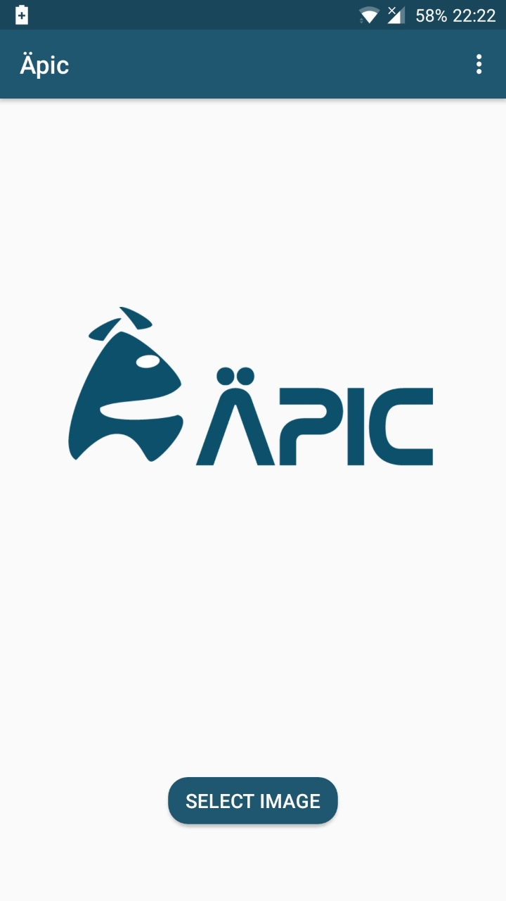
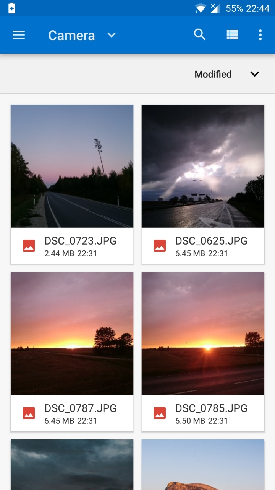
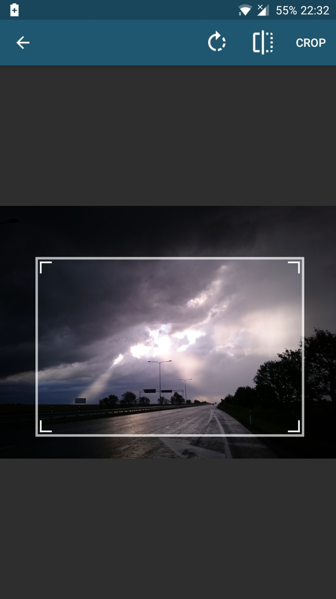
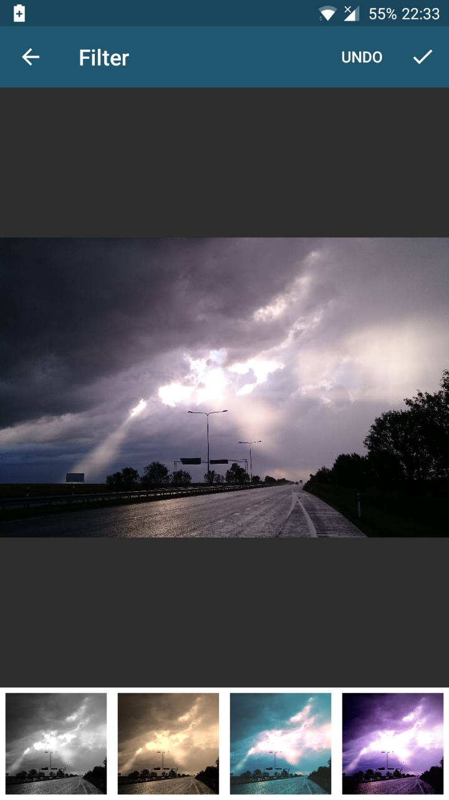
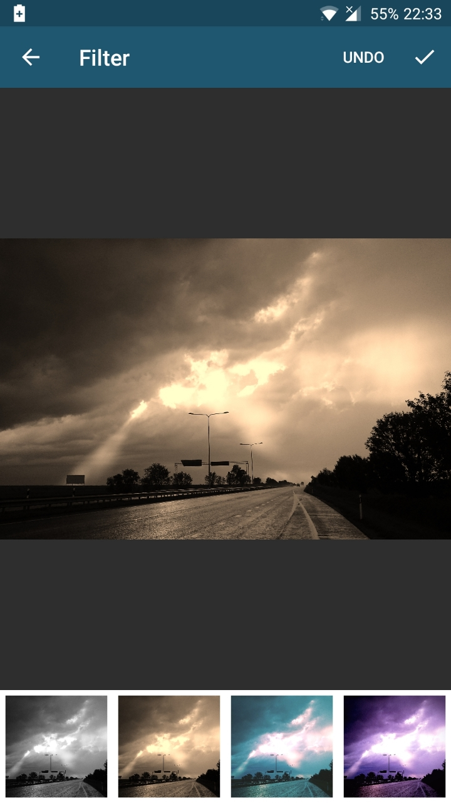
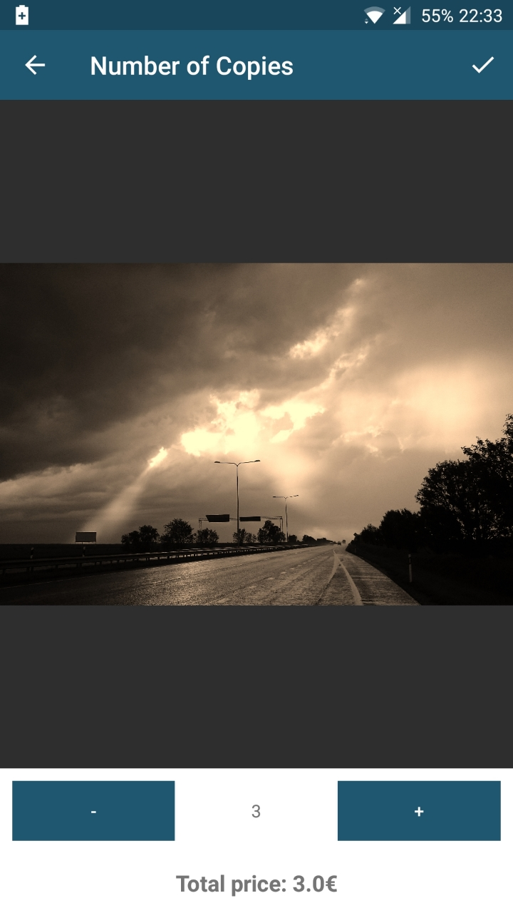
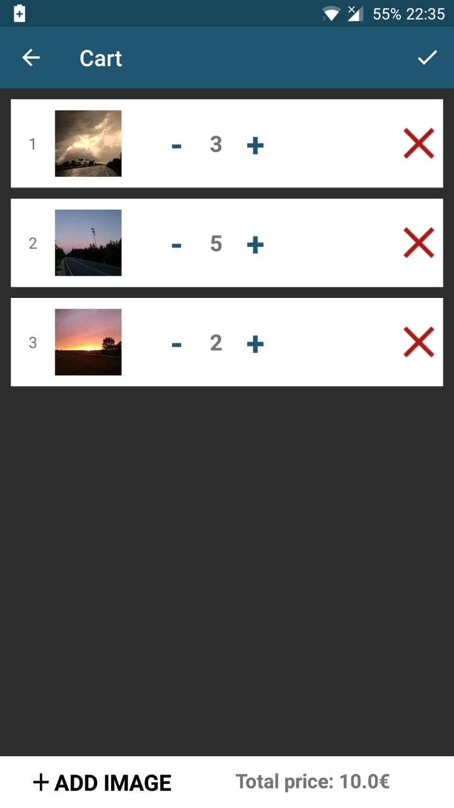
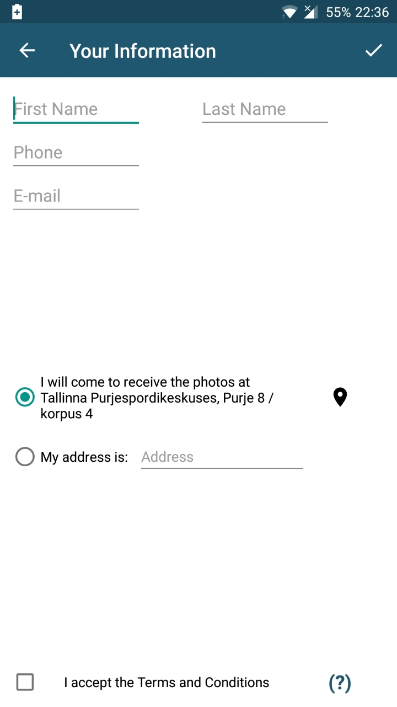

# Äpic Android versioon  
  
## Eesmärk  
Arendada kliendile rakendus, mida saab kasutada nii Androidi kui ka iOSi platvormil. Rakendust saab kasutada piltide ilmutamise tellimiseks.  
  
## Kirjeldus  
Kasutaja saab rakenduse abil valida telefonist pilte, mida ta soovib saata ilmutamisse. Rakenduse abil saab pildid lõigata õigesse 2:3 suhtesse ning kasutajal on kontroll selle üle, millist pildi osa ta soovib säilitada. Lisaks saab mugavalt valida soovitud piltide koguseid.  
  
## Õpime Tallinna Ülikoolis Deigitehnoloogiate instituudis informaatika erialal. Projekt on loodud kursuse Tarkvaraarenduse praktika raames.  
  
## Kasutatud tehnoloogia  
  
Android Studio 3.1, Adobe Illustrator CC 2018, Git Bash  
  
## Meeskond  
  
Veli Vaigur, Petrik Sarri, Martin Sõmer, Kalmer Roopa, Roland Kasenurm  
  
## Paigaldusjuhised  
  
Paigaldamiseks peab avama telefonis seaded ning seejärel liikuma alamkategooriasse "Turvalisus". Seal peab lubama "Tundmatud allikad". Seejärel saab failihalduris avada .apk faili ning see paigaldada.  
  
## Arenduskeskkonna ülesseadmise juhised  
  
Arenduskeskkonna üles seadmiseks peab paigaldama Android Studio ning selle avades valima "Check out project from version control", avanevast menüüst valida "GitHub". Avaneb aken, kuhu tuleb kleepida repositooriumi URL ning valida kohalik kaust, kuhu kloonida. Pärast projekti kloonimise ja laadimise lõppemist peab ülevalt paremalt valima "Sync Project with Gradle Files". Pärast seda peaks saama projekti ehitada ülevalt ribalt "Make Project" nupuga või seda käivitada kas virtuaalse või ühendatud füüsilise seadme peal nupuga "Run 'app'".  
    
## Litsents  
  
https://www.apache.org/licenses/LICENSE-2.0  
Projektis kasutatud teegid:  
* Android Image Cropper: https://github.com/ArthurHub/Android-Image-Cropper  
* Android Photo Filters: https://github.com/ravi8x/AndroidPhotoFilters  
* GPUImage for Android: https://github.com/CyberAgent/android-gpuimage  
  
## Ekraanipildid  
  
Front Page             |  Select Image
:-------------------------:|:-------------------------:
  |    
  
Crop Image             |  Filters
:-------------------------:|:-------------------------:
  |    
  
Filter Applied             |  Select Quantity
:-------------------------:|:-------------------------:
  |    
  
Cart             |  User Info
:-------------------------:|:-------------------------:
  |  